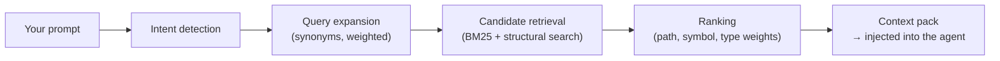

# ⚡ Knocode — Semantic code search for AI coding agents

**Knocode is a local search runtime that makes AI coding agents find the right code up to 228× faster than `grep` — and find files grep can't see at all.** It runs as a local daemon, watches your repository, and enriches every agent prompt with a compact pack of the most relevant code and docs.

No cloud. No code leaves your machine.

---

## The problem

When your agent needs to answer *"how do I add error handling here?"*, it has to find the relevant files first. Almost every agent today falls back to **grep** — literal text matching from 1974:

```
grep -rE "error handling"        →  files that literally say "error handling"
                                    misses docs, tests, error types, related components
                                    3.7 seconds on a 54k-file repo

Knocode                          →  error types, try/catch patterns, docs, tests, config
                                    understands what you *mean*
                                    9 milliseconds on the same repo
```

---

## 📊 The numbers — Knocode vs grep

Measured with 50 realistic queries per repo against `grep -rE`, engine v0.9.11, final lock-in run 2026-09-11. Full methodology and per-query breakdowns: [**docs/BENCHMARKS_V1.md**](docs/BENCHMARKS_V1.md).

### Speed

| Codebase | Files | grep (p50) | **Knocode (p50)** | Speedup |
|---|---|---|---|---|
| Knocode repo | 163 | ~500 ms | **1–2 ms** | up to **228×** |
| Mattermost | 9,850 | ~800 ms | **6 ms** | **133×** |
| DefinitelyTyped | 53,828 | ~5,100 ms | **9 ms** | **218×** |

```
Time to find relevant code (p50, lower is better — bars to scale)

                grep -rE                                       Knocode
163 files       ██ 500 ms                                      ▏ 1.5 ms   →  up to 228× faster
9,850 files     ███ 800 ms                                     ▏ 6 ms     →  133× faster
53,828 files    ███████████████████ 5,100 ms                   ▏ 9 ms     →  218× faster
```

Single-digit milliseconds means your agent can search **on every prompt, in real time** — grep's multi-second stalls cannot.

### Quality — what grep can't find

The real gap isn't speed. It's that literal matching is blind to everything that doesn't spell the query out:

| Query | Grep finds | Knocode finds |
|---|---|---|
| "how to add error handling" | files with literal "error handling" | error types, try/catch patterns, **docs, tests** |
| "find all API endpoints" | files with "API" + "endpoint" | route definitions, handler registrations, **API docs** |
| "why does the auth fail" | files with "auth" + "fail" | auth middleware, session handling, permission checks |

```
Novel results — files Knocode returns that grep cannot find at all

knocode repo (163 files)      ███████████████████████████████████  87%
Mattermost (9,850 files)      █████████████████████  53%
DefinitelyTyped (53,828)      ███████████████  36%
```

And where it matters most, coverage is complete: **on small repos (≤500 files), Knocode returns every file grep finds, on every query — plus the semantically related set.** Ranking quality is measured too: on a 50-task golden eval, the expected file is now typically ranked **#1** (MRR **0.245 → 0.697** this release cycle).

### Token economics

A Knocode context pack costs ~4,500 tokens of curated, ranked files — and eliminates the agent's own exploratory searching (tool-output tokens drop **600 → ~85 per task, −86%**). Your agent spends its budget *writing code*, not hunting for it.

---

## How it works



- **Retrieval engine** — intent detection → query expansion → BM25 full-text + ast-grep structural search → weighted ranking. Finds by meaning, not spelling.
- **Repository intelligence** — tree-sitter AST parsing (33 languages), dependency graph, incremental indexing with fast warm re-indexes (`mtime` shortcut).
- **Fail-open, always** — if anything goes wrong or times out (30 s budget), your agent gets its original prompt back untouched. Knocode can only *add* value, never block you.
- **Local-first** — SQLite + tantivy on your disk, local token counting, secrets redacted before anything outbound.

---

## Install

**Windows** (PowerShell one-liner):

```powershell
irm https://raw.githubusercontent.com/leonortega/knocode/main/install.ps1 | iex
```

**Linux / macOS:**

```bash
curl -fsSL https://raw.githubusercontent.com/leonortega/knocode/main/install.sh | bash
```

**Scoop** (Windows, per-user, no admin):

```powershell
scoop bucket add knocode https://github.com/leonortega/knocode
scoop install knocode
```

Or grab `knocode-<ver>-x86_64-pc-windows-msvc.zip` directly from the [Releases page](https://github.com/leonortega/knocode/releases). Prebuilt binaries — no Rust toolchain needed for end users.

The installer asks which agents to wire up (**OpenCode**, **Copilot for VS Code**, **Claude Code**) and configures them automatically. It also installs Git and Node.js if missing.

**Uninstall:**

```powershell
powershell -ExecutionPolicy Bypass -c 'irm https://github.com/leonortega/knocode/releases/latest/download/uninstall.ps1 -OutFile "$env:TEMP\knocode-uninstall.ps1"; if ($?) { & "$env:TEMP\knocode-uninstall.ps1" }'   # Windows
curl -fsSL https://github.com/leonortega/knocode/releases/latest/download/uninstall.sh | bash -s -- --force                       # Linux/macOS
```

---

## Quick start

```bash
knocode init      # set up the current repository (.knocode/config.toml)
knocode serve     # start the daemon — first start indexes your repo automatically
```

That's it. The daemon listens on `127.0.0.1:9527` and auto-reindexes as you work (default: on every git commit; `KNOCODE_WATCH_MODE=filesystem` for real-time). Bundled agent plugins wait for indexing to finish before their first request — no manual readiness dance.

### Everyday commands

| Command | What it does |
|---|---|
| `knocode serve` | Start the daemon (HTTP + MCP, port 9527) |
| `knocode preview "<prompt>"` | See exactly what context your agent would get |
| `knocode status` | Daemon status and metrics |
| `knocode doctor` | 8-probe health check of the whole installation |
| `knocode config show` / `config validate` | Inspect / validate configuration |

### Configuration (env vars override `.knocode/config.toml`)

| Variable | Default | Meaning |
|---|---|---|
| `KNOCODE_CONTEXT_MAX_TOKENS` | 12000 | Token budget for the context pack |
| `KNOCODE_MAX_FILES` | 20 (auto: 50 on repos ≤500 files) | Files per pack — explicit pins are never auto-overridden |
| `KNOCODE_CANDIDATE_K` | 100 | Candidate pool size before ranking |
| `KNOCODE_WATCH_MODE` | `commit` | `commit` (git polls) or `filesystem` (real-time) |
| `KNOCODE_LOG_LEVEL` | `info` | `debug`/`trace` = verbose; also settable via `knocode config set-log-level` |
| `KNOCODE_DAEMON_URL` | `http://127.0.0.1:9527` | Daemon endpoint for CLI/plugins |
| `KNOCODE_READY_TIMEOUT_MS` | 10000 | How long plugins wait for indexing before giving up (fail-open) |

---

## Tech stack — what Knocode is built on

All processing is local. These are the open-source engines behind each layer:

| Tool | Role in Knocode | Owner / URL |
|---|---|---|
| **tantivy** | BM25 full-text search index | https://github.com/quickwit-oss/tantivy |
| **tree-sitter** | Incremental AST parsing (symbol extraction) | https://tree-sitter.github.io/tree-sitter/ |
| **tree-sitter-language-pack** | 371 grammar pack (33 languages active) | https://github.com/Goldziher/tree-sitter-language-pack |
| **ast-grep** | Structural (syntax-aware) code search | https://github.com/ast-grep/ast-grep |
| **ripgrep** | Graceful fallback + grep-comparison baseline | https://github.com/BurntSushi/ripgrep |
| **SQLite (rusqlite)** | Local storage, WAL mode | https://github.com/rusqlite/rusqlite |
| **tokio** | Async runtime for the daemon | https://github.com/tokio-rs/tokio |
| **tiktoken-rs** | Local token accounting (cl100k_base) | https://github.com/zurawiki/tiktoken-rs |
| **notify** | Real-time filesystem watching | https://github.com/notify-rs/notify |
| **git2 (libgit2)** | Commit-based index triggering | https://github.com/rust-lang/git2-rs |
| **tracing** | Structured logging & observability | https://github.com/tokio-rs/tracing |
| **Prometheus** | Metrics exposition (`GET /metrics`) | https://prometheus.io/ |
| **RTK** *(optional)* | Tool-output compression, opt-in via installer | https://github.com/rtk-ai/rtk |

---

## Documentation

| Doc | Contents |
|---|---|
| [docs/BENCHMARKS_V1.md](docs/BENCHMARKS_V1.md) | Full benchmark report: methodology, per-repo results, ablations, version progression |
| [docs/01-architecture/ARCHITECTURE.md](docs/01-architecture/ARCHITECTURE.md) | System architecture |
| [docs/ROADMAP.md](docs/ROADMAP.md) | Release history and plans |
| [CONTRIBUTING.md](CONTRIBUTING.md) | Building from source, development workflow |

**Building from source** (contributors only): `cargo build --release` at the repo root — see [CONTRIBUTING.md](CONTRIBUTING.md).

## License

MIT
