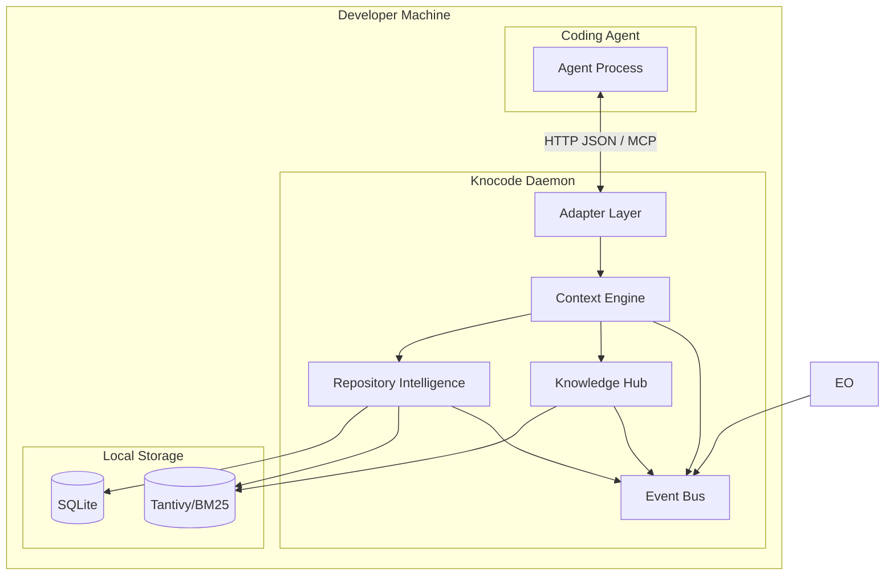
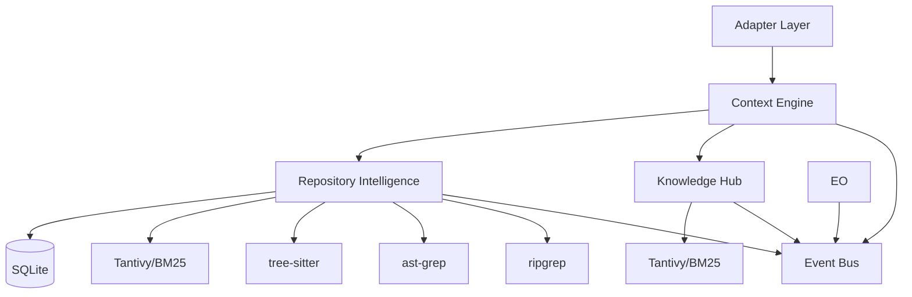

# Architecture

> **V1 framing:** see [V1_RUNTIME_SPEC.md](V1_RUNTIME_SPEC.md) — product definition,
> ownership boundaries, and the out-of-scope list. Removed capabilities (Model Router /
> LiteLLM v0.8.6, workflow and the Skill Engine — see `REMOVED_TOOLS.md`) are deleted
> from this file. Where this file conflicts with the V1 spec or the code, the V1
> spec / code win.

## Purpose

Define the complete v1 architecture of the AI Runtime for Coding Agents. This document describes how components relate, what each owns, and how data flows through the system.

## System Overview

The runtime is a single-process local daemon written in Rust. It receives coding tasks from a coding agent via native hooks (pre-generation), processes them through a pipeline of modules, and returns token-efficient context. All processing happens on the developer's machine. The runtime makes **no external LLM calls**: it is model-agnostic, and the coding agent talks to its model provider directly. Tool-output compression is delegated to RTK (external binary) — see `REMOVED_TOOLS.md`.

The runtime exposes one clean API: `BuildContext(task)` → `ContextPack` (plus a readiness probe). The workflow engine (DBOS) is removed — the runtime is a single tokio daemon (see `REMOVED_TOOLS.md`).

## Architecture Diagram



> The Skill Engine is removed (see `REMOVED_TOOLS.md`) — agents own skill
> discovery natively. Model routing is removed; the runtime is model-agnostic (§2.3).

## Module Responsibilities

| Module | Primary Responsibility | Key Operation |
|--------|----------------------|---------------|
| Adapter Layer | Bridge agent and daemon | intercept_before_generation (HTTP `POST /hook`, MCP `tools/call`) |
| Context Engine | Build token-budgeted Context Packs | BuildContext(task) |
| Repository Intelligence | Incremental AST parsing and search | index_repository, search_code, search_symbols |
| Knowledge Hub | Store and retrieve all knowledge | store, retrieve |
| Execution Optimizer | ❌ removed — compression delegated to RTK | — |
| Event Bus | Async observability events | emit(event) |

## Dependency Graph



## Process Model

### Single Daemon Process

The runtime runs as a single Rust daemon process. All modules execute within this process using async tasks on the tokio runtime. The daemon exposes a single HTTP listener (default `127.0.0.1:9527`) serving `POST /hook`, `POST /mcp`, `GET /health` and `GET /metrics`.

```
┌──────────────────────────────────────────────────────────┐
│                  knocode daemon process                   │
│                                                          │
│  ┌──────────────────┐  ┌──────────────────────────────┐  │
│  │  HTTP Server     │  │     Module Pipeline           │  │
│  │  (axum)          │  │                              │  │
│  │  /hook /mcp      │  │  Adapter → Context Engine →  │  │
│  │  /health /metrics│  │  RI + KH                     │  │
│  └──────────────────┘  └──────────────────────────────┘  │
│                                                          │
│  ┌──────────────────┐  ┌──────────────────────────────┐  │
│  │  Rate Limiter    │  │     Local Storage             │  │
│  │  (token bucket)  │  │  - SQLite connection pool     │  │
│  │                  │  │  - SQLite+tantivy local       │  │
│  │                  │  │  - Tantivy index handles      │  │
│  │                  │  │  - Filesystem handles         │  │
│  └──────────────────┘  └──────────────────────────────┘  │
│                                                          │
│  ┌──────────────────────────────────────────────────┐    │
│  │              Event Bus (async channel)             │    │
│  └──────────────────────────────────────────────────┘    │
│                                                          │
└──────────────────────────────────────────────────────────┘
           │
           │  HTTP JSON — POST /hook, POST /mcp
           ▼
  ┌─────────────────┐
  │  Coding Agent   │
  └─────────────────┘
```

### Thread Model

| Thread | Purpose |
|--------|---------|
| Main thread | Daemon lifecycle, signal handling, configuration loading |
| HTTP server (axum) | Accepts requests from the coding agent |
| tokio async pool | Handles concurrent request processing |
| Tantivy background threads | Index merging and maintenance (managed by Tantivy) |
| SQLite connection pool | Concurrent database access |
| Event bus | Async event dispatch on separate task |

## Module Communication

### v1 Communication Pattern

Modules communicate through **direct function calls** within the daemon process. There is no message queue, event bus, or pub/sub on the hot path.

```
Adapter Layer
    │
    └──calls──→ Context Engine
                    │
                    ├──calls──→ Repository Intelligence
                    │               │
                    │               └──returns──→ SearchResults
                    │
                    ├──calls──→ Knowledge Hub
                    │               │
                    │               └──returns──→ Vec<KnowledgeEntry>
                    │
                    └──returns──→ ContextPack
```

Tool-output compression is **not** part of the daemon pipeline — it is delegated to RTK (external binary) wired by the installers (see `REMOVED_TOOLS.md`).

### Event Bus (Async Only)

The event bus is strictly for observability. It is never in the `BuildContext` call path.

```
Context Engine ──emit──→ Event Bus ──consume──→ CLI Inspection
Repository Intelligence ──emit──→ Event Bus ──consume──→ Metrics
```

## Interface Contracts

### IContextBuilder

```rust
trait IContextBuilder {
    async fn build_context(&self, task: &TaskRequest) -> Result<ContextPack>;
    fn to_yaml(pack: &ContextPack) -> Result<String>;
}
```

Reference implementation: Rust daemon with HTTP IPC. Lock strategy: acquire all mutex guards once at the start of `build_context`, pass `&MutexGuard` references to helpers (`search_code_scored`, `retrieve_knowledge_scored`). This eliminates redundant lock contention and enables future parallelism via `tokio::join!`.

### IModelGateway — [REMOVED v0.8.6]

Model routing / LiteLLM were deleted from the v1 runtime (see REMOVED_TOOLS.md).
The runtime is model-agnostic — the agent / provider / user chooses the model
(V1_RUNTIME_SPEC.md §2.3).

### IWorkflowEngine — [REMOVED]

The workflow engine (DBOS) was removed — trait, `knocode-workflow` crate, and the
daemon's `workflow` cargo feature are gone (see `REMOVED_TOOLS.md`). The runtime is
a single tokio daemon.

## Data Ownership

| Data | Owner | Storage | Lifecycle |
|------|-------|---------|-----------|
| Repository source code | Developer / Git | Filesystem (read-only) | Managed externally |
| Repository ASTs | Repository Intelligence | In-memory + cached | Rebuilt on incremental update |
| Repository metadata | Repository Intelligence | SQLite | Persistent across restarts |
| BM25/tantivy index | Repository Intelligence + Knowledge Hub | Tantivy directory | Persistent across restarts |
| Memory entries | Knowledge Hub | SQLite+tantivy local | Persistent across restarts |
| Knowledge entries | Knowledge Hub | SQLite + Tantivy | Persistent across restarts |

| Context pack | Context Engine | In-memory per request | Ephemeral |
| Session fingerprint | Context Engine | In-memory per session | Lost on daemon restart (v1) |
| Token usage metrics | Context Engine | SQLite | Persistent across restarts |
| Configuration | Developer | TOML files | Persistent, developer-managed |
| Logs | Runtime | Log files | Persistent, rotated |
| Events | Event Bus | In-memory channel | Ephemeral (consumed by CLI/metrics) |

### SQLite as Persistence Backbone

SQLite is the primary persistence layer for all structured metadata:

- **Files:** file paths, content hashes, metadata (tracked for incremental re-indexing)
- **Symbols:** AST-extracted symbols (functions, classes, methods) with file associations
- **Knowledge:** documents ingested from README, ADRs, and other sources
- **Sessions:** session fingerprints for deduplication, token usage metrics
- **Graph:** dependency edges between files (import/use/require relationships)

Tantivy is the search index (full-text BM25). Tree-sitter is the parser. Graph is the relationship layer. All three are built from the same source code walk during `knocode init`.

## Initialization Pipeline

`knocode init` runs a 7-step pipeline:

```
[1/7] Scaffold (.knocode/, config, database)
[2/7] Repository discovery (languages, frameworks, commands)
[3/7] Downloading tree-sitter grammars
[4/7] Parser validation (verify tree-sitter grammars load)
[5/7] Indexing (full-text BM25 + symbol extraction + dependency graph)
[6/7] Knowledge Hub initialization
[7/7] Validation queries (smoke test) + repository profile
```

Each step is fail-open: errors in one step don't block subsequent steps. The validation step probes Tantivy, SQLite symbols, graph edges, and knowledge entries independently, then writes `.knocode/profile.json`.

## Retrieval Status

`RetrievalStatus` distinguishes between different failure modes:

```rust
pub enum RetrievalStatus {
    Found(usize),              // Results were found
    NoMatch,                   // Search ran successfully but found nothing
    IndexNotBuilt,             // No index exists (init never ran)
    IndexUnavailable,          // Index exists but is empty/unreachable
    ParserFailed(Vec<String>), // Tree-sitter grammars failed to load
    KnowledgeHubUnavailable,   // Knowledge Hub not initialized
    RetrievalFailed(String),   // Search threw an error
    FallbackUsed(String),      // Used fallback method (e.g. ripgrep after Tantivy miss)
}
```

This enables the daemon to report structured diagnostics instead of generic "no results" when retrieval fails.

## Technology Stack

| Layer | Technology | Role |
|-------|------------|------|
| Language | Rust (>= 1.75) | Context Engine, daemon, all modules |
| Agent IPC | HTTP/JSON only (`axum`) on `127.0.0.1:9527` — no socket transport | Daemon ↔ Agent; `POST /hook`, HTTP `Probe` payload (readiness), `GET /health` (readiness `state: indexing\|ready`), `GET /metrics` |
| MCP (Model Context Protocol) | JSON-RPC 2.0 over HTTP (`POST /mcp`) on the same axum listener (`127.0.0.1:9527`) | Daemon-hosted MCP - `initialize` / `ping` / `tools/list` / `tools/call`; tool `knocode_context` (compression = RTK, external); JSON-RPC `-32001 daemon_indexing` while indexing; client = opencode plugin (`no-conversion` tool path, `/hook` fallback) |
| AST Parsing | tree-sitter — **371 grammars available** via `tree-sitter-language-pack` (42-language registry, 33 with parsers) | `repo-intel/src/parser.rs` + `repo-intel/src/registry.rs` |
| Structural Search | In-process `AstGrepBackend` (ast-grep-core + tree-sitter-language-pack) via `StructuralRetriever` | `retrieval/structural.rs` + `repo-intel/src/structural/` |
| Text Search | ripgrep (`grep-searcher`+`grep-regex`+`ignore`) | `search_text()` |
| Full-text Index | tantivy `MmapDirectory` (in-process) | `storage/src/tantivy_index.rs` + `search_fulltext()` wiring |
| Dependency Graph | `graph.rs` adjacency (`import`/`use`/`require`) + `edges` table `003_graph.sql` (local AST+regex) | `repo-intel/src/graph.rs` |
| Watcher | Two modes: `commit` (default — polls the resolved HEAD commit via git2, triggers on new commits) or `filesystem` (`notify` + git2 dirty-check; feature `fs-watcher`, enabled by the CLI and daemon) | `repo-intel/src/watcher.rs` |
| LSP | Stub `LspClient` (`KNOCODE_LSP_ENABLED=true` → probe, never hard dep) | `repo-intel/src/lsp.rs` |
| Reranking | Removed from v1 runtime per benchmark evaluation (passthrough only) — see REMOVED_TOOLS.md | — |
| Memory | SQLite+tantivy local (engram removed — see REMOVED_TOOLS.md) | `knocode-storage` local | |
| Model Gateway | [REMOVED v0.8.6] LiteLLM + heuristic routing deleted — runtime is model-agnostic | see REMOVED_TOOLS.md |
| Compression | RTK `RtkAdapter::detect()` (binary if present, `~10ms`) → built-ins + tee `~/.knocode/logs/tool-failures/` | `optimizer/src/rtk.rs` |
| Token Counting | `tiktoken-rs` `cl100k_base` + `heuristic` fallback | `context/src/lib.rs:389`/`optimizer/src/lib.rs:303` |
| Orchestration | Removed — single tokio daemon (see `REMOVED_TOOLS.md`) | — |
| Metrics | Prometheus exposition (`GET /metrics`, histogram `knocode_build_context_duration_seconds`) | `daemon/src/metrics.rs` |
| Rate Limit | Token-bucket 10/s burst 20 per session (`daemon/src/ratelimit.rs`) | `daemon/src/ratelimit.rs` + `core/src/secrets.rs` |
| Concurrency | `tokio::sync::Mutex<ContextEngine>`, `session_fingerprints` SHA-256 dedup | `daemon/src/http_server.rs` + `context/src/lib.rs` |
| Directory Walking | `ignore` crate | `.gitignore` |
| Database | SQLite `rusqlite` bundled + WAL + `r2d2` pool, migrations `001, 002, 003, 006, 007` | `storage/src/lib.rs:21` |
| Serialization | `serde`+`toml`+`serde_json`+`serde_yaml` | Config + HTTP IPC (JSON) |
| CLI | `clap` | `knocode-cli` (init/index/serve/preview/doctor/config) |
| Logging | `tracing`+`tracing-subscriber` (json `fmt`) | `daemon` |
| Testing/Bench | `cargo test` (165 tests) + `promptfoo` + `criterion` `benches/context_bench.rs` (p95 <50ms) | `benches/` |
| Distribution | GitHub Releases (Windows x64 zip), install scripts (`scripts/install.ps1` / `install.sh`), Scoop + winget manifests | `.github/workflows/release.yml`, `winget/` |
| Async Runtime | `tokio` full | `daemon` |
| HTTP Client | `reqwest` | `cli` |
