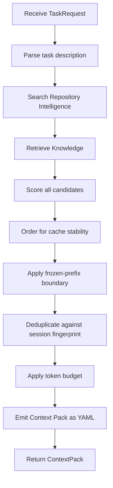

# Components

> **V1 framing:** see [V1_RUNTIME_SPEC.md](V1_RUNTIME_SPEC.md) — product definition,
> ownership boundaries, and the out-of-scope list. Removed capabilities (Model Router /
> LiteLLM v0.8.6, workflow and the Skill Engine — see `REMOVED_TOOLS.md`) are deleted
> from this file. Where this file conflicts with the V1 spec or the code, the V1
> spec / code win.

## Purpose

Define every v1 module in detail. Each module section specifies purpose, responsibilities, inputs, outputs, dependencies, persistent data, runtime behavior, errors, boundaries, and implementation requirements.

---

## 1. Adapter Layer

### Purpose

Bridge the coding agent and the daemon. One thin adapter per agent CLI, implementing two operations: intercept-before-generation (rewrite the message) and intercept-before-tool-call (allow/deny/modify).

### v0.2.0 Implementation

- **HTTP server** (axum) on port 9527 with JSON IPC
- **Fail-open** on timeout or error: returns OriginalPassthrough
- **OpenCode plugin** (TypeScript) for pre-generation hooks
- **Claude Code hooks** (shell scripts) for UserPromptSubmit

### Responsibilities

- Accept HTTP connections from agents
- Parse JSON-encoded requests
- Validate request format and content
- Generate correlation IDs
- Route requests to the appropriate handler (Context Engine)
- Format responses in agent-consumable JSON
- Implement fail-open on timeout or error
- Handle agent-specific hook differences

### Inputs

| Input | Type | Description |
|-------|------|-------------|
| PreGeneration | MessageRewrite | Session ID, message, optional context hints |
| Probe | Readiness | (no fields) — answered before rate-limiting, no engine lock |

### Outputs

| Output | Type | Description |
|--------|------|-------------|
| RewrittenMessage | ContextPack | Rewritten message with injected context |
| OriginalPassthrough | Original message + reason | Fail-open: unmodified message |
| Probe | state, index_files, version | Readiness answer (while indexing: HTTP `503 daemon_indexing`) |

### Dependencies

- Context Engine (for pre-generation)
- tokio (async I/O)
- rmp-serde (MessagePack)

### Persistent Data

None. The Adapter Layer is stateless.

### Runtime Behavior

1. Accept UDS connection from agent
2. Read MessagePack-encoded request
3. Parse and validate request
4. Generate correlation ID (`req_{uuid}`)
5. Start tracing span with correlation ID
6. Route to appropriate handler:
   - PreGeneration → Context Engine `BuildContext`
7. On success: return formatted response
8. On timeout (> 30s) or error: return OriginalPassthrough
9. Log request received and response sent

### Errors

| Error | Behavior |
|-------|----------|
| Invalid MessagePack | Return OriginalPassthrough with reason "invalid_request" |
| Missing required field | Return OriginalPassthrough with reason "invalid_request" |
| Timeout | Return OriginalPassthrough with reason "timeout" |
| Internal error | Return OriginalPassthrough with reason "fail-open" |

### Boundaries

- Does not access repository directly
- Does not build context packs
- Does not compress tool outputs
- Only translates between agent format and daemon format
- Must be thin: minimal logic, fast execution

### Agent-Specific Adapters

#### opencode Adapter

| Hook | Runtime Operation |
|------|-------------------|
| `chat.message` (pre-generation) | Call Context Engine, rewrite message |
| `tool.execute.after` | ❌ removed — output compression delegated to RTK |

#### Claude Code Adapter

| Hook | Runtime Operation |
|------|-------------------|
| `UserPromptSubmit` (pre-generation) | Call Context Engine, rewrite message. **Hard 30s timeout.** |
| `PreToolUse` | ❌ removed — output compression delegated to RTK |

### Implementation Requirements

- Use tokio for async UDS server
- Use rmp-serde for MessagePack encoding/decoding
- Use uuid crate for correlation ID generation
- Validate all input before passing to modules
- Log every request and response at INFO level
- Include correlation ID in all log entries
- Implement 30s timeout for Claude Code hooks
- Return OriginalPassthrough on any error

---

## 2. Context Engine

### Purpose

The central module and one public entry point: `BuildContext(task)`. Retrieves relevant information, ranks and reranks results, deduplicates, compresses, orders for cache stability, enforces token budgets, and emits a Context Pack as YAML.

### Responsibilities

- Coordinate Repository Intelligence and Knowledge Hub
- Assemble context from multiple sources
- Order context for cache stability: docs → code
- Apply frozen-prefix boundary
- Enforce token budgets
- Manage session fingerprint to avoid duplicate content
- Track token usage per request
- Emit Context Pack as YAML
- Run as a long-lived daemon process

### Inputs

| Input | Type | Description |
|-------|------|-------------|
| BuildContext | TaskRequest | Task description, session ID, context hints |

### Outputs

| Output | Type | Description |
|--------|------|-------------|
| ContextPack | YAML | Two sections: docs_context, code_context |

### Dependencies

- Repository Intelligence (code search and file content)
- Knowledge Hub (knowledge retrieval)
- tiktoken-rs (local token counting)
- tokio (async runtime)

### Persistent Data

| Data | Storage | Purpose |
|------|---------|---------|
| Token usage | SQLite `token_usage` table | Track token consumption per request |
| Session fingerprint | In-memory (per session) | Avoid duplicate context |

### Runtime Behavior

#### BuildContext Pipeline



#### Cache-Aware Ordering

The Context Pack is ordered in this fixed sequence for maximum prompt cache stability:

```yaml
# Frozen-prefix boundary: everything above is cache-stable
# Everything below changes between tasks

# Section 1: Moderately cache-stable (changes rarely)
docs_context:
  - path: "docs/architecture.md"
    content: "..."
  - path: "docs/conventions.md"
    content: "..."

# Section 2: Least cache-stable (changes frequently)
code_context:
  - path: "src/router.ts"
    content: "..."
    line_range: [1, 50]
  - path: "src/middleware/auth.ts"
    content: "..."
    line_range: [1, 30]
```

#### Token Budget Allocation

| Source | Budget Allocation | Priority | Cache Stability |
|--------|-------------------|----------|-----------------|
| docs_context | 45% of budget | 1 (highest) | Highest |
| code_context | 55% of budget | 2 | Lowest |
| metadata (implicit) | remaining | 3 | N/A |

#### Deduplication

1. Compute SHA-256 hash of each content block
2. Check hash against session fingerprint
3. If hash already in fingerprint: skip content block
4. If hash not in fingerprint: include and add to fingerprint

#### Token Estimation

- Use tiktoken-rs for token counting (local, no API round-trip)
- Fallback: estimate 1 token per 4 characters for non-English content
- Count tokens for each content block before inclusion

### Errors

| Error | Behavior |
|-------|----------|
| Repository search failure | Continue with empty code_context |
| Knowledge retrieval failure | Continue with empty docs_context |
| Token estimation failure | Use character-based estimation |
| Any unrecoverable error | Return OriginalPassthrough (fail-open) |

### Boundaries

- Does not search the repository directly (delegates to Repository Intelligence)
- Does not retrieve knowledge directly (delegates to Knowledge Hub)
- Orchestrates and assembles the final output
- Must complete within 30 seconds (fail-open on timeout)

### Implementation Requirements

- Build in Rust for predictable low memory, no GC-pause latency
- Embed tree-sitter/ast-grep/ripgrep as native Rust crates (not shelled out)
- Run as a long-lived daemon, not spawn-per-request
- Communicate with Adapter Layer over Unix domain socket with MessagePack
- Memory-map retrieval indices rather than loading fully into RAM
- Quantize reranker model (int8 ONNX) for RAM savings
- Use tiktoken-rs for local token counting
- Enforce 30s timeout, return OriginalPassthrough on exceed
- Log token usage at every stage
- Emit ContextBuilt event on completion

---

## 3. Repository Intelligence

### Purpose

Parse, index, and search the codebase incrementally. Uses tree-sitter for incremental AST parsing, ripgrep for text search. Updated on git changes, not per-request.

### v0.2.0 Implementation

- **tree-sitter** for AST parsing (Rust, Python, JavaScript, TypeScript)
- **ripgrep** (grep-searcher) for fast text search with .gitignore support
- **ignore crate** for respecting .gitignore patterns
- **Regex fallback** for unsupported languages
- **Incremental indexing** via SHA-256 content hashing

### Responsibilities

- Walk repository directory tree
- Parse source files with tree-sitter (incremental)
- Extract symbols (functions, classes, structs, enums, imports)
- Store file metadata and symbol information in SQLite
- Search code by text (ripgrep) with .gitignore support
- Detect project type and language distribution
- Track file changes for incremental updates

### Inputs

| Input | Type | Description |
|-------|------|-------------|
| index_repository | Path | Repository root path to index |
| search_text | SearchQuery | Text search query with filters |
| search_structural | StructuralQuery | AST pattern search query |
| search_fulltext | FulltextQuery | Full-text search query |
| get_file_info | Path | Get metadata for a specific file |
| get_symbol_info | SymbolQuery | Find symbol definitions and references |
| get_file_content | Path | Read file content with line range |

### Outputs

| Output | Type | Description |
|--------|------|-------------|
| IndexResult | Index statistics | Files indexed, symbols extracted, duration |
| SearchResults | Vec<SearchResult> | Ranked search results with file paths, line numbers, context |
| FileInfo | File metadata | Path, size, language, symbol count, last modified |
| SymbolInfo | Symbol details | Name, kind, location, references |
| FileContent | String | File content with line numbers |

### Dependencies

- tree-sitter (embedded Rust crate, not shelled out)
- ast-grep (embedded Rust crate, not shelled out)
- ripgrep (embedded Rust crate, not shelled out)
- BM25/tantivy (in-process)
- SQLite (metadata storage)
- Filesystem (source code reads)
- Optional: LSP (agent's own language server processes)

### Persistent Data

| Data | Storage | Purpose |
|------|---------|---------|
| File metadata | SQLite `files` table | Track indexed files |
| Symbol information | SQLite `symbols` table | Track code structure |
| Full-text index | BM25/tantivy directory | Enable full-text search |
| Language statistics | SQLite | Project composition analysis |

### Runtime Behavior

#### Indexing (Triggered by Git Change)

1. Detect git change (file system watcher or manual trigger)
2. Walk directory tree, skip ignored paths
3. For each recognized source file:
   a. Read file content
   b. Compute content hash
   c. Check if file already indexed with same hash
   d. If unchanged: skip
   e. If new or changed: parse with tree-sitter (incremental)
   f. Extract symbols and structure
   g. Add to BM25/tantivy index
   h. Store metadata in SQLite
4. Remove deleted files from index
5. Emit RepositoryUpdated event
6. Log indexing statistics

#### Text Search

1. Receive search query with pattern and optional filters
2. Execute ripgrep (in-process) with pattern and filters
3. Parse results into SearchResults
4. Rank by relevance (ripgrep relevance + file proximity)
5. Return top N results

#### Structural Search

1. Receive AST pattern
2. Execute ast-grep (in-process) with pattern
3. Parse results into SearchResults
4. Return matching code locations

#### Full-text Search

1. Receive search query
2. Search BM25/tantivy index
3. Parse results with snippets
4. Return ranked results

### Errors

| Error | Behavior |
|-------|----------|
| File not found | Skip file, log warning, continue indexing |
| Parse failure | Skip file, log warning, continue indexing |
| Index write failure | Retry once, then fail index operation |
| SQLite write failure | Fatal — cannot persist index |
| tree-sitter grammar missing | Skip language, log warning |
| ast-grep not available | Degraded — structural search unavailable |

### Boundaries

- Does not interpret code semantics
- Does not make AI-based relevance judgments
- Does not modify source code
- Does not manage version control
- Only reads repository, never writes to it (except to .knocode/)
- Optional LSP enrichment is never a hard dependency

### Implementation Requirements

- Embed tree-sitter as native Rust crate (tree-sitter crate)
- Embed ast-grep as native Rust crate
- Embed ripgrep as native Rust crate
- Use tantivy crate for BM25 indexing and search
- Use rusqlite for database operations
- Implement incremental indexing via content hash comparison and tree-sitter's incremental parsing
- Cache tree-sitter parsers in memory for repeated use
- Handle binary files gracefully (skip, do not crash)
- Log indexing progress every 100 files
- Emit RepositoryUpdated event when indexing completes

---

## 4. Knowledge Hub

### Purpose

One organizational surface for project docs, ADRs, templates, and long-term memory. Lexical (BM25) search over stored knowledge and docs (engram and reranking removed — see REMOVED_TOOLS.md, REMOVED_TOOLS.md).

### v0.2.0 Implementation

- **SQLite** for knowledge storage with LIKE-based search
- **tantivy BM25** for lexical retrieval
- **Pattern detection** for knowledge extraction (naming, architectural, domain)

### Responsibilities

- Store and retrieve knowledge entries across all categories
- Perform lexical search for docs and code
- Store and retrieve memory via SQLite+tantivy local
- Detect and extract knowledge from indexed code
- Decay confidence of unused knowledge

### Inputs

| Input | Type | Description |
|-------|------|-------------|
| store_knowledge | KnowledgeEntry | Knowledge to store |
| retrieve_knowledge | KnowledgeQuery | Query to find relevant knowledge |
| extract_knowledge | ExtractRequest | Extract knowledge from code analysis |
| memory_save | MemoryEntry | Save to memory (SQLite local) |
| memory_search | MemoryQuery | Search memory (SQLite local) |

### Outputs

| Output | Type | Description |
|--------|------|-------------|
| Vec<KnowledgeEntry> | Knowledge entries | Retrieved knowledge ranked by relevance |

### Dependencies

- SQLite (knowledge + memory storage)
- BM25/tantivy (knowledge and docs search index)

### Persistent Data

| Data | Storage | Purpose |
|------|---------|---------|
| Knowledge entries | SQLite `knowledge` table | Store knowledge with metadata |
| Knowledge index | BM25/tantivy | Enable full-text search of knowledge |
| Memory entries | SQLite (local) | Persistent cross-session memory |

### Runtime Behavior

#### Knowledge Retrieval

1. Receive query string and optional category filter
2. Search BM25/tantivy index for matching entries
3. Retrieve top 20 candidates
4. Filter by minimum confidence threshold (0.3)
6. Return top 10 results

#### Knowledge Extraction

1. Receive code analysis results from Repository Intelligence
2. Detect naming patterns (e.g., files use snake_case)
3. Detect architectural patterns (e.g., controller-service-repo)
4. Detect domain terms (e.g., "mission" in this project means "task")
5. Store detected knowledge with confidence based on evidence strength

### Errors

| Error | Behavior |
|-------|----------|
| SQLite write failure | Log warning, continue without storing |
| BM25/tantivy write failure | Log warning, continue without indexing |
| SQLite memory unreachable | Continue without memory, log warning |
| SQLite memory unavailable | Continue without memory, log warning |
| Duplicate key | Merge with existing entry |

### Boundaries

- Does not perform code analysis (receives analysis from Repository Intelligence)
- Does not make AI-based knowledge judgments (uses pattern detection only)
- Does not expose knowledge to the coding agent directly
- Only provides knowledge through the Context Engine
### Implementation Requirements

- Use SQLite for knowledge storage
- Use BM25/tantivy for knowledge search
- Use SQLite for memory operations (engram removed)
- Knowledge categories: `convention`, `pattern`, `domain`, `decision`
- Each knowledge entry has: id, category, key, value, confidence, source, created_at, updated_at
- Implement confidence decay as a background task

---

## 5. Skill Engine — [REMOVED]

> The Skill Engine (`knocode-skills` crate, skill load/match, `behavioral_skills`)
> was removed — agents own skill discovery natively (see `REMOVED_TOOLS.md`).


---

## 5. Model Router — [REMOVED v0.8.6]

> Model routing / LiteLLM were deleted from the v1 runtime in v0.8.6 (see
> REMOVED_TOOLS.md). The runtime is model-agnostic — the agent / provider /
> user chooses the model (V1_RUNTIME_SPEC.md §2.3). This section is retained as a
> numbered stub so later section numbers stay stable.

---

## 6. Execution Optimizer (removed)

> **Removed from the daemon.** Tool-output compression lives entirely in RTK
> (github.com/rtk-ai/rtk), an external binary the installers download opt-in and
> wire into the selected agents via `rtk init`. The daemon serves
> `knocode_context` only — see `REMOVED_TOOLS.md`.

### What changed

- The daemon's `PreToolCall`/`ToolOutput`/`CompressedOutput` IPC variants, the
  `/hook` `ToolOutput` contract, and the `ExecutionOptimizer` state were deleted.
- Agents that want output compression should run RTK's own plugin/hook for the
  selected agent (`rtk init -g --auto-patch --opencode` / `--copilot`).

### Pointer

See RTK's documentation for its compression behavior, compression levels, and
fail-open semantics.

---

## 7. Event Bus

### Purpose

Async-only observability system for metrics, debugging, inspection, and future orchestration. Never in the `BuildContext` call path.

### Responsibilities

- Emit events from all modules
- Dispatch events to subscribers
- Provide event history for inspection CLI
- Support metrics aggregation

### Events

| Event | Emitter | Payload |
|-------|---------|---------|
| ContextBuilt | Context Engine | correlation_id, token_counts, file_count, latency_ms |
| RepositoryUpdated | Repository Intelligence | files_indexed, symbols_extracted, duration_ms |
| ToolExecuted | ❌ removed with Execution Optimizer | — |
| ResponseGenerated | Adapter Layer | correlation_id, hook_type, latency_ms, error |
| MemorySaved | Knowledge Hub | entry_id, namespace, key |

### Dependencies

- tokio (async channels)

### Persistent Data

None. Events are ephemeral, consumed by subscribers.

### Runtime Behavior

1. Modules emit events via `event_bus.emit(event)`
2. Events are dispatched to all registered subscribers
3. Subscribers process events asynchronously
4. Events are not buffered persistently (v1)
5. CLI inspection command reads recent events from in-memory buffer

### Subscribers

| Subscriber | Purpose |
|------------|---------|
| CLI Inspection | Preview what a prompt would build |
| Metrics | Aggregate token usage, latency, error rates |
| Future Orchestrator | Trigger workflows based on events (separate product) |

### Errors

| Error | Behavior |
|-------|----------|
| Subscriber failure | Log warning, continue emitting to other subscribers |
| Channel full | Drop oldest events, log warning |

### Boundaries

- Never in the `BuildContext` call path
- Strictly async/observability
- Does not affect request processing
- Does not block the daemon

### Implementation Requirements

- Use tokio::sync::broadcast for event dispatch
- Buffer last 1000 events in memory for inspection
- Log event emission at TRACE level
- Events are fire-and-forget: emitter does not wait for processing

---

## 8. Local Storage

### Purpose

Provide persistent storage for repository index, metadata, and metrics.

### Responsibilities

- Store and retrieve repository file metadata
- Store and retrieve symbol information
- Store and retrieve token usage metrics
- Manage database schema migrations
- Provide connection pooling for concurrent access

### Dependencies

- SQLite (rusqlite crate)
- r2d2 (connection pooling)

### Persistent Data

| Table | Purpose |
|-------|---------|
| `files` | Repository file metadata |
| `symbols` | Code structure information |
| `token_usage` | Token consumption metrics |
| `schema_migrations` | Database version tracking |

### Runtime Behavior

#### Database Initialization

1. Open SQLite at configured path
2. Check schema version
3. If version mismatch: run pending migrations
4. Enable WAL mode
5. Set journal size limit
6. Create connection pool

#### Migration Strategy

- Each migration is a numbered SQL string
- Migrations run in order
- Migrations are idempotent (use IF NOT EXISTS)
- Schema version tracked in `schema_migrations` table

### Errors

| Error | Behavior |
|-------|----------|
| Database locked | Retry after 100ms, max 3 retries |
| Database corrupted | Fatal — process exit |
| Disk full | Fatal — process exit |
| Migration failure | Fatal — process exit |

### Boundaries

- Only stores data owned by the runtime
- Never stores source code (only references and metadata)
- Provides raw storage, no business logic

### Implementation Requirements

- Use rusqlite with WAL mode
- Use r2d2 for connection pooling
- Implement migrations as embedded SQL strings
- Log slow queries (>100ms) at DEBUG level
- Log database errors at ERROR level

---

## 10. CLI

### Purpose

Provide command-line interface for daemon management, repository inspection, and health checking.

### Responsibilities

- Start the daemon
- Initialize a repository for runtime use
- Trigger repository re-indexing
- Preview what a prompt would build
- Show daemon status and health
- Show configuration

### Commands

| Command | Description |
|---------|-------------|
| `knocode serve` | Start the daemon |
| `knocode init` | Initialize runtime for current repository |
| `knocode index` | Trigger repository re-indexing |
| `knocode preview <prompt>` | Preview what BuildContext would produce for a prompt |
| `knocode status` | Show daemon status and metrics |
| `knocode config show` | Show effective configuration |
| `knocode config validate` | Validate configuration file |
| `knocode doctor` | Health check: verify all dependencies are available |

### Dependencies

- clap (argument parsing)
- All daemon modules (for init, index, preview, status)

### Runtime Behavior

#### `knocode serve`

1. Load configuration
2. Initialize logging
3. Open database and index
4. Initialize knowledge store
5. Index repository (background)
6. Start Unix socket server
7. Print startup banner with socket path
8. Wait for shutdown signal

#### `knocode init`

1. Create `.knocode/` directory in current repo
2. Create default `.knocode/config.toml`
3. Initialize SQLite database
4. Create BM25/tantivy index
5. Run initial indexing
6. Print success message with statistics

#### `knocode preview <prompt>`

1. Connect to daemon via UDS
2. Send PreGeneration request with prompt
3. Receive ContextPack
4. Print formatted preview:
   - Knowledge entries
   - Code files included
   - Token counts

### Errors

| Error | Behavior |
|-------|----------|
| Configuration not found | Print helpful message with setup instructions |
| Daemon not running | Print message to run `knocode serve` first |
| Invalid arguments | Print clap-generated help |

### Boundaries

- Does not implement daemon logic
- Only provides CLI interface to daemon modules
- Does not run the daemon (only starts it)

### Implementation Requirements

- Use clap derive macros for argument parsing
- Use colored output for terminal readability
- Use human-readable formatting for large numbers
- Print version from Cargo.toml
- Implement `doctor` command to verify all dependencies
