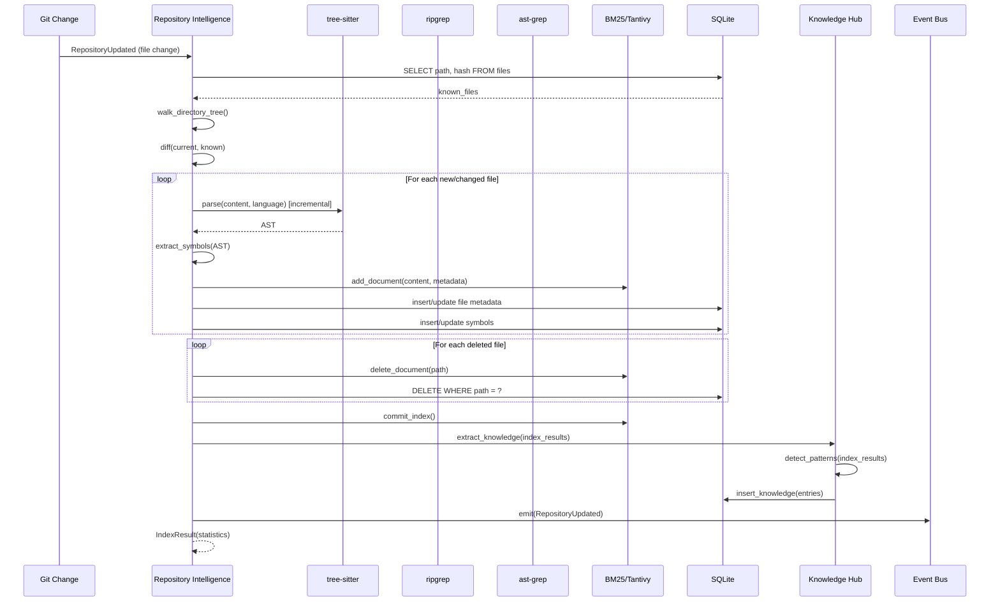
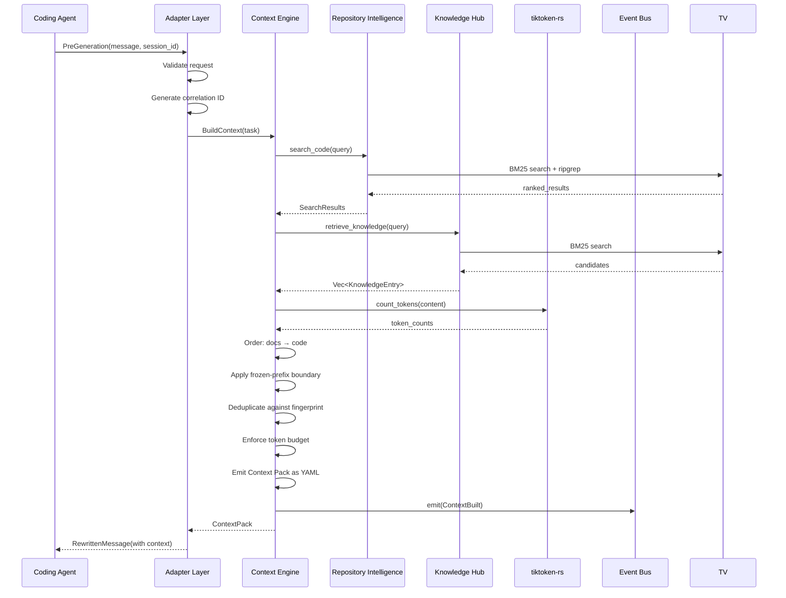
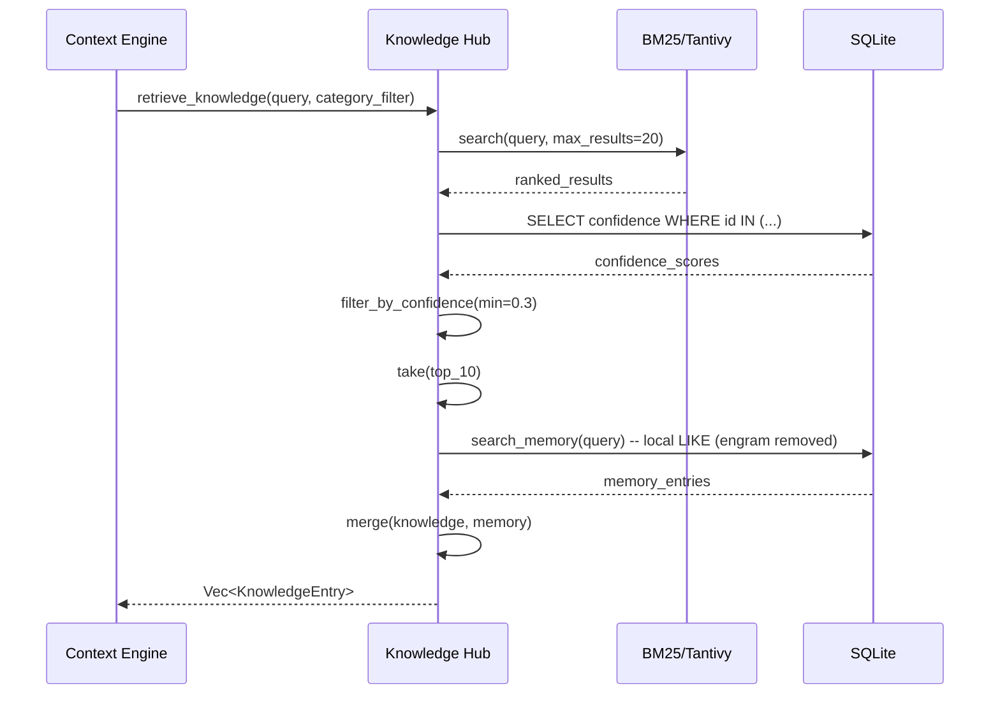
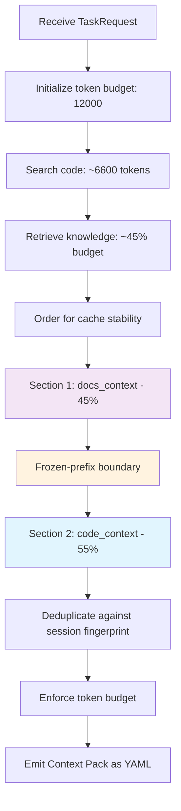
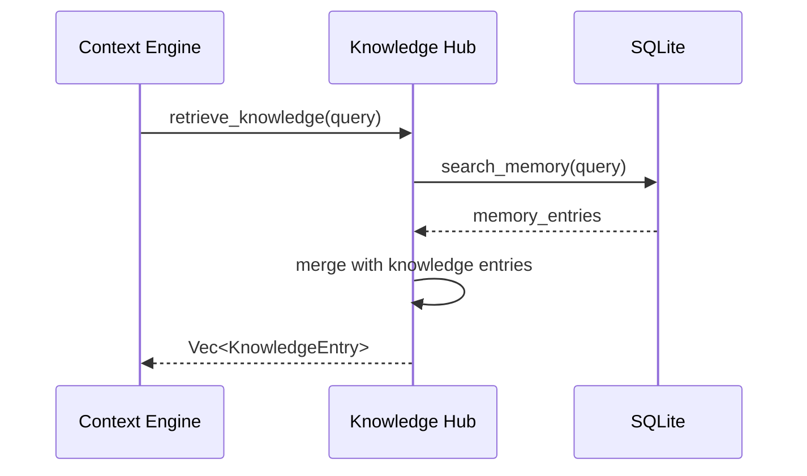
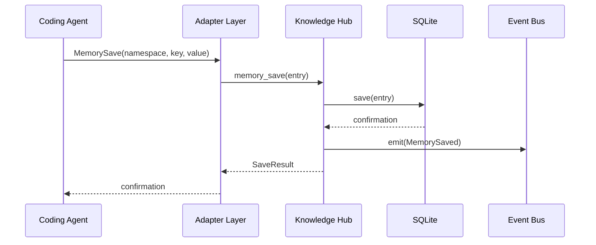
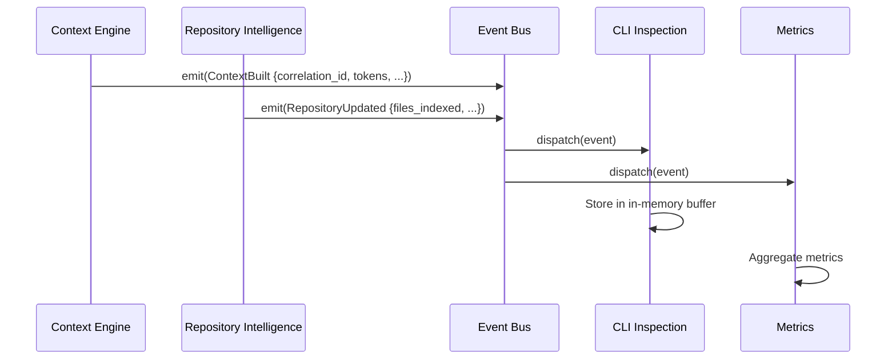
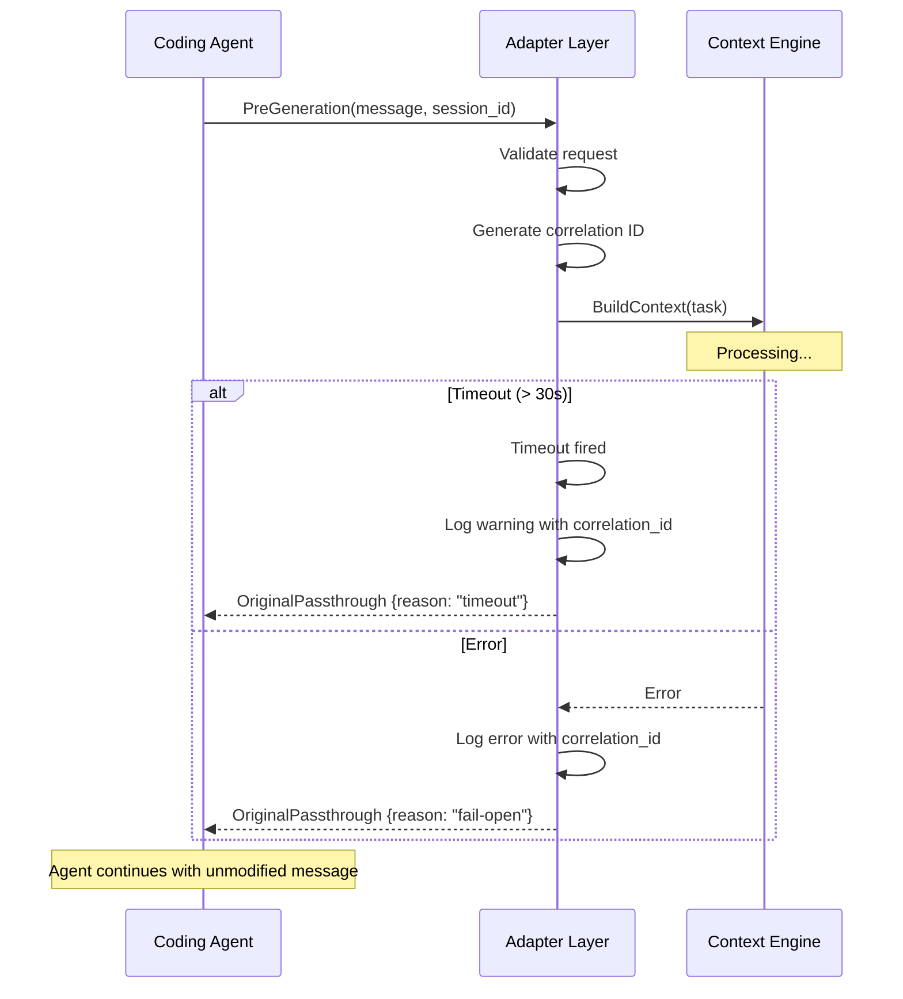

# Data Flow

> **V1 framing:** see [V1_RUNTIME_SPEC.md](V1_RUNTIME_SPEC.md). Model Router /
> LiteLLM were deleted in v0.8.6 (see REMOVED_TOOLS.md) — Flow 7 (Model Routing) is removed.
> Flow 5 (Skill Selection) is removed with the Skill Engine (see `REMOVED_TOOLS.md`).
> Where this file conflicts with the V1 spec or the code, the V1 spec / code win.

## Purpose

Describe all important data flows through the AI Runtime. Each flow shows the sequence of operations, data transformations, and module interactions.

## Flow 1: Repository Indexing (Incremental)

### Trigger

- Git change detected (file system watcher or manual trigger)
- `knocode index` command
- SIGHUP or SIGUSR1 signal

### Sequence



### Delta Detection

1. Query SQLite for all known file paths and hashes
2. Walk current filesystem
3. Compute three sets:
   - **New files**: in filesystem, not in database
   - **Changed files**: in both, but hash differs
   - **Deleted files**: in database, not in filesystem
4. Process each set accordingly

---

## Flow 2: Pre-Generation (BuildContext)

### Trigger

- Agent's pre-generation hook fires (e.g., `chat.message`, `UserPromptSubmit`)

### Sequence



---

## Flow 3: Pre-Tool (Tool Output Compression)

> **Removed:** the daemon no longer compresses tool outputs. Compression lives
> entirely in RTK (external binary, wired by the installers via `rtk init`); the
> `PreToolCall`/`ToolOutput`/`CompressedOutput` IPC variants were deleted — see
> `REMOVED_TOOLS.md`.

### Trigger

- None (historical). The `PreToolCall` flow was removed from the daemon.

---

## Flow 4: Knowledge Retrieval

### Trigger

- Part of BuildContext pipeline (Flow 2)

### Sequence



### KnowledgeEntry Structure

```json
{
  "id": 42,
  "category": "convention",
  "key": "naming_functions",
  "value": "Functions use camelCase naming convention",
  "confidence": 0.95,
  "source": "detected from 15 function definitions",
  "relevance_score": 0.87
}
```

---

## Flow 5: Skill Selection — [REMOVED]

> Skill matching ran inside BuildContext as an optional path. The Skill Engine was
> removed — agents own skill discovery natively (see `REMOVED_TOOLS.md`).


---

## Flow 6: Context Construction (Cache-Aware)

### Trigger

- Part of BuildContext pipeline (Flow 2)
- Orchestrates Flow 4

### Sequence



### Cache-Aware Ordering Detail

```
Context Pack Structure (YAML):

┌─────────────────────────────────────────────────┐
│ docs_context                       45%  5,400 tok│
│ ████████████████████████████████████████         │
│ (Most cache-stable: byte-identical across tasks)│
├───────── FROZEN-PREFIX BOUNDARY ────────────────┤
│ code_context                       55%  6,600 tok│
│ ████████████████████████████████████████         │
│ ████████████████████████████████████████         │
│ ████████████████████████████████████████         │
│ (Least stable: changes frequently)               │
└─────────────────────────────────────────────────┘
```

### Code File Selection

1. Search Repository Intelligence with task description
2. Get top 20 candidate files
3. Score each file by:
   - Text match relevance (0.0–1.0)
   - Structural relevance (imports, function calls) (0.0–1.0)
   - File proximity (same directory = higher) (0.0–1.0)
4. Sort by composite score
5. Add files to context until code budget is exhausted
6. For each file, truncate to `max_lines_per_file` if needed

---

## Flow 7: Model Routing — [REMOVED v0.8.6]

Model routing / LiteLLM were deleted from the v1 runtime (see REMOVED_TOOLS.md).
The runtime is model-agnostic — the agent / provider / user chooses the model
(V1_RUNTIME_SPEC.md §2.3). Flow 2 (BuildContext) ends at `ContextPack`.

---

## Flow 8: Memory Operations (SQLite+tantivy local — engram removed, see REMOVED_TOOLS.md)

### Read (In Hot Path)



### Write (Agent-Invoked, Async)



---

## Flow 9: Event Bus (Async Observability)

### Sequence



---

## Flow 10: Fail-Open (Timeout/Error)

### Trigger

- BuildContext exceeds 30s timeout
- Any unrecoverable error in the pipeline

### Sequence



### Fail-Open Guarantees

| Condition | Response | Agent Impact |
|-----------|----------|--------------|
| BuildContext timeout | OriginalPassthrough | None — original message used |
| BuildContext error | OriginalPassthrough | None — original message used |
| Repository not indexed | OriginalPassthrough | None — original message used |
| Any internal error | OriginalPassthrough | None — original message used |

The agent always gets a response. The runtime never blocks or breaks the agent.
