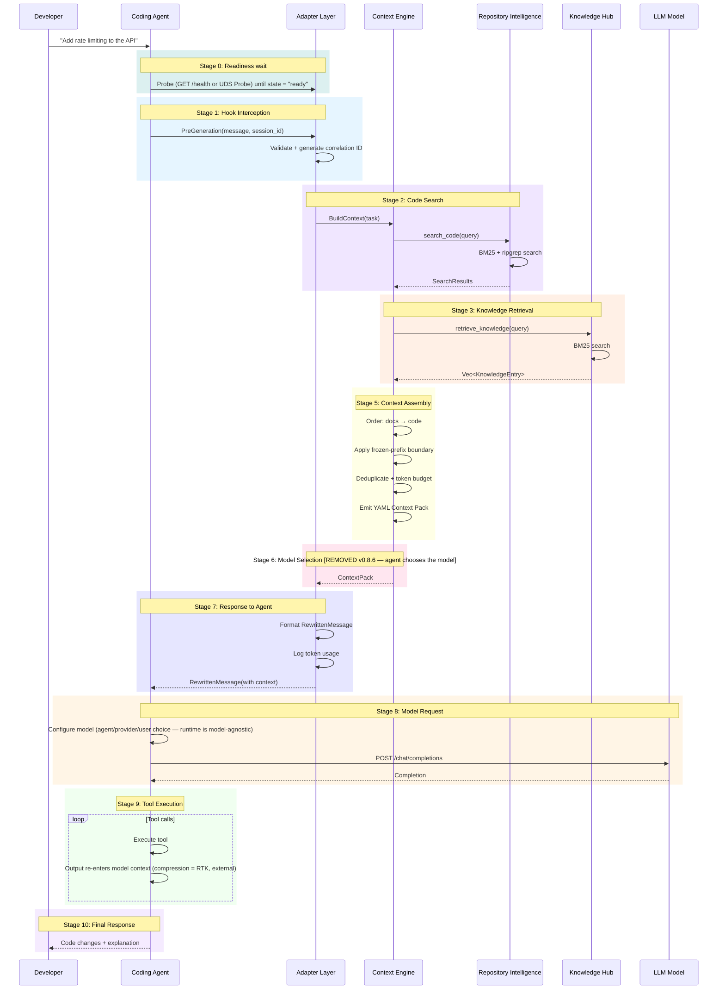
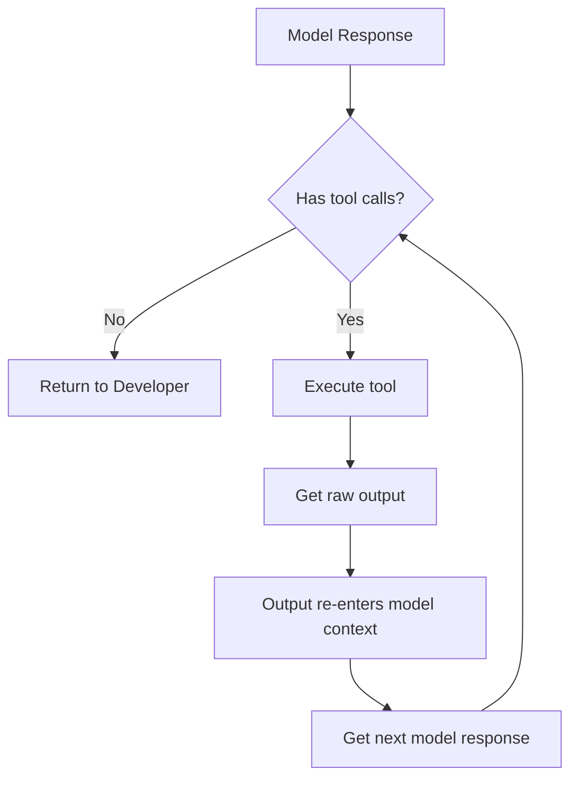

# Request Lifecycle

> **V1 framing:** see [V1_RUNTIME_SPEC.md](V1_RUNTIME_SPEC.md). Stage 6 (Model
> Routing) was deleted in v0.8.6 — the runtime is model-agnostic and the agent
> chooses the model. Stage 4 (Skill Selection) was deleted with the Skill Engine
> (see `REMOVED_TOOLS.md`). Stage 0 (Readiness) precedes every request. Where this
> document conflicts with the V1 spec, the V1 spec wins.

## Purpose

Define one complete request from user task to final response. Every stage is specified precisely with inputs, outputs, behavior, and error handling.

## Complete Lifecycle



---

## Stage 0: Readiness Wait

### Entry Point

Before the first request, the agent must confirm the daemon is ready. During the
cold start (initial index) the UDS socket is NOT bound yet — the daemon gates
binding on indexing completion — so readiness is polled over HTTP first.

### Processing

1. Poll HTTP `GET /health` until `state == "ready"` (or `GET /metrics` shows
   `knocode_daemon_ready 1`). During indexing these answer `state: "indexing"`.
2. Once the UDS socket exists, the same signal is available on the primary
   transport via the `Probe` payload (`{ "type": "Probe" }`) — answered before
   rate-limiting, never gated, no engine lock.
3. If a real request is sent while not ready: HTTP `POST /hook` returns `503`
   (`reason: "daemon_indexing"`). Retry with backoff — this is a retry signal,
   not a fail-open passthrough.

### Output

A confirmed-ready daemon. Proceed to Stage 1.

---

## Stage 1: Hook Interception

### Entry Point

Developer provides a natural-language task to the coding agent (daemon already
confirmed ready — Stage 0). The agent's pre-generation hook fires before the model
generates a response.

### Input

```json
{
  "hook_type": "PreGeneration",
  "session_id": "session_abc123",
  "message": "Add rate limiting to the API",
  "context_hints": {
    "files_mentioned": ["src/router.ts", "src/middleware/"],
    "language": "typescript"
  }
}
```

### Processing

1. Adapter Layer receives MessagePack-encoded request over UDS
2. Parse and validate request
3. Generate correlation ID: `req_{uuid_v4}`
4. Start tracing span with correlation ID
5. Log: `INFO hook_received correlation_id={id} hook_type=PreGeneration`

### Output

Internal `TaskRequest` struct passed to Context Engine.

### Errors

| Error | Response |
|-------|----------|
| Invalid MessagePack | OriginalPassthrough {reason: "invalid_request"} |
| Missing `message` | OriginalPassthrough {reason: "invalid_request"} |
| Missing `session_id` | OriginalPassthrough {reason: "invalid_request"} |

---

## Stage 2: Code Search

### Entry Point

Context Engine needs to find relevant code in the repository.

### Input

- Task description from message
- File hints from context_hints
- Language filter from context_hints

### Processing

1. Build search query from task description + file hints
2. Execute text search via ripgrep (in-process):
   - Pattern: key terms from task description
   - Scope: files matching language filter if provided
   - Ignore: .git, node_modules, target, etc.
3. Execute full-text search via BM25/tantivy (in-process):
   - Query: task description
   - Fields: content, symbols
   - Max results: 50
4. Merge results from both searches
5. Deduplicate by file path
6. Score each result:
   - ripgrep match: 0.5 base score
   - BM25 score: normalized to 0.0–1.0
   - File proximity bonus: +0.1 if in hinted directory
7. Sort by composite score descending
8. Return top 20 results
9. Log: `DEBUG code_search_completed results={count}`

### Output

```rust
SearchResults {
    results: Vec<SearchResult>,  // max 20
    total_matches: usize,
    search_duration_ms: u64,
}

SearchResult {
    file_path: String,
    line_start: usize,
    line_end: usize,
    score: f64,
    snippet: String,
    language: String,
}
```

### Errors

| Error | Behavior |
|-------|----------|
| ripgrep unavailable | Fatal — text search unavailable |
| BM25/tantivy search failure | Degraded — return ripgrep results only |
| No results found | Empty results, continue with other stages |

---

## Stage 3: Knowledge Retrieval

### Entry Point

Context Engine needs repository-specific knowledge to enrich the context.

### Input

- Task description
- Search results from Stage 2 (for context)
- Category filter: none (retrieve all categories)

### Processing

1. Build knowledge query from task description
2. Search BM25/tantivy knowledge index:
   - Query: task description
   - Max results: 20
3. Filter by confidence >= 0.3, take top 10
4. Search SQLite memory for relevant entries (engram removed)
5. Merge knowledge entries with memory entries
6. Log: `DEBUG knowledge_retrieved entries={count}`

### Output

```rust
Vec<KnowledgeEntry>  // max 10

KnowledgeEntry {
    id: i64,
    category: String,       // "convention", "pattern", "domain", "decision"
    key: String,
    value: String,
    confidence: f64,
    source: Option<String>,
    relevance_score: f64,   // from search/rerank
}
```

### Errors

| Error | Behavior |
|-------|----------|
| BM25/tantivy search failure | Return empty list, log warning |
| SQLite memory unreachable | Continue without memory (engram removed) |
| No knowledge found | Empty list, continue |

---

## Stage 4: Skill Selection — [REMOVED]

> Skill matching ran between knowledge retrieval and context assembly as an
> optional path. The Skill Engine was removed — agents own skill discovery
> natively (see `REMOVED_TOOLS.md`). Stage 3 hands directly to Stage 5.


---

## Stage 5: Context Assembly

### Entry Point

All retrieval stages complete. Context Engine assembles the final Context Pack.

### Input

- TaskRequest (message, hints)
- SearchResults (from Stage 2)
- Vec<KnowledgeEntry> (from Stage 3)
- Session fingerprint (existing context)
- Token budget (from configuration)

### Processing

#### Step 1: Initialize Budget

```
total_budget = config.context.max_tokens  // default: 12000
remaining = total_budget
```

#### Step 2: Order for Cache Stability

Content is assembled in this fixed order for maximum prompt cache hit rates:

1. **docs_context** (45% of budget) — Most cache-stable
2. **Frozen-prefix boundary** — Marks where stable content ends
3. **code_context** (55% of budget) — Least stable

#### Step 3: Add Docs Context

```
docs_budget = total_budget * 0.15  // 1800 tokens

for entry in knowledge_entries:
    entry_tokens = count_tokens(entry.value)
    if entry_tokens <= remaining AND entry_tokens <= docs_budget:
        add entry to docs_context section
        remaining -= entry_tokens
        docs_budget -= entry_tokens
```

#### Step 5: Frozen-Prefix Boundary

All content above this line is cache-stable. Content below changes between tasks.

#### Step 6: Add Code Context

```
code_budget = total_budget * 0.55  // 6600 tokens

for result in search_results:
    file_content = read_file(result.file_path, result.line_start, result.line_end)
    content_hash = sha256(file_content)
    
    if content_hash in session_fingerprint:
        continue  // already sent
    
    file_tokens = count_tokens(file_content)
    if file_tokens <= remaining AND file_tokens <= code_budget:
        add file to code_context section
        remaining -= file_tokens
        code_budget -= file_tokens
        session_fingerprint.insert(content_hash)
```

#### Step 7: Finalize

```yaml
# Context Pack (YAML)
docs_context:
  - path: "docs/conventions.md"
    content: "All middleware follows the Express middleware signature..."
code_context:
  - path: "src/router.ts"
    content: "export function setupRoutes(router: Router) {...}"
    line_range: [1, 50]
    token_count: 800
```

### Output

```rust
ContextPack {
    docs_context: Vec<KnowledgeEntry>,
    code_context: Vec<CodeFile>,
    token_usage: TokenUsage,
}

TokenUsage {
    total_tokens: usize,
    budget_remaining: usize,
    by_source: HashMap<String, usize>,
}
```

### Errors

| Error | Behavior |
|-------|----------|
| File read failure | Skip file, log warning |
| Token counting failure | Use character-based estimation |
| Budget exceeded | Truncate last-added content |
| All sources empty | Return minimal context with task description only |

---

## Stage 6: Model Selection — [REMOVED v0.8.6]

> Model routing was deleted in v0.8.6: BuildContext is deterministic and the runtime
> is model-agnostic (V1_RUNTIME_SPEC.md §2.3). The agent / provider / user chooses
> the model. There is no routing stage — the Context Pack passes straight from the
> Context Engine (Stage 5) to the Adapter Layer (Stage 7).

---

## Stage 7: Response to Agent

### Entry Point

Context pack ready. Format and return to agent.

### Input

- ContextPack from Stage 5
- Correlation ID from Stage 1

### Processing

1. Assemble RewrittenMessage:
   ```
   response = RewrittenMessage {
       original: original_message,
       rewritten: inject_context(original_message, context_pack),
       context_pack: Some(context_pack),
   }
   ```

2. Log token usage to SQLite

3. Emit ContextBuilt event

4. Log: `INFO request_completed correlation_id={id} tokens={total} model={model}`

5. Return MessagePack response over UDS

### Output

The rewritten message includes the original message plus injected context:

```
[SYSTEM CONTEXT — Generated by Knocode Runtime]
Context Pack (8,500 tokens):
- 2 knowledge entries (middleware convention, API design pattern)
- 5 code files (router.ts, auth.ts, middleware/, config.ts, types.ts)

[ORIGINAL MESSAGE]
Add rate limiting to the API
```

### Token Usage Tracking

Every request logs token usage to SQLite:

```sql
INSERT INTO token_usage (correlation_id, request_type, input_tokens, output_tokens, model, tier, created_at)
VALUES ('req_xyz789', 'context', 8500, 0, 'gpt-4o', 'balanced', '2025-01-15T10:30:00Z');
```

### Errors

| Error | Response |
|-------|----------|
| Context build failure | OriginalPassthrough (fail-open) |
| Token logging failure | Return response, log warning |

---

## Stage 8: Model Request

### Entry Point

Coding agent receives the rewritten message and uses it to make a model request.

### Note

This stage is performed by the **coding agent**, not the runtime. The runtime provides the rewritten message with injected context. The agent uses this as input to its normal model request flow.

### Agent Processing

1. Receive rewritten message with injected context
2. Include in the model's prompt
3. Choose model (agent/provider/user — the runtime is model-agnostic, V1_RUNTIME_SPEC.md §2.3)
4. Send to model provider directly
5. Receive model response

### Agent Output

Model response with code changes, explanations, and tool calls.

---

## Stage 9: Tool Execution

### Entry Point

Model response contains tool calls (file reads, search, shell). Tool outputs are **not** compressed by the runtime — compression lives entirely in RTK (external binary, wired by the installers via `rtk init`); see `REMOVED_TOOLS.md`.

### Tool Execution Loop



---

## Stage 10: Final Response

### Entry Point

Model has completed all tool calls and produced a final response.

### Processing

1. Agent assembles final response from model output
2. Agent applies code changes (file edits, creates)
3. Agent presents response to developer

### Developer Receives

- Code changes (diffs or new files)
- Explanation of changes
- Any warnings or notes from the model

### Runtime Side

After the request cycle completes:
1. Token usage logged to SQLite
2. Session fingerprint maintained for next request
3. Events emitted for observability
4. Logs written

---

## Timing Budget

| Stage | Target Duration | Maximum Duration |
|-------|-----------------|------------------|
| Stage 0: Readiness Probe | < 1ms | 5ms |
| Stage 1: Hook Interception | < 2ms | 10ms |
| Stage 2: Code Search | < 50ms | 200ms |
| Stage 3: Knowledge Retrieval | < 30ms | 100ms |
| Stage 4: Skill Selection | N/A (removed — see `REMOVED_TOOLS.md`) | N/A |
| Stage 5: Context Assembly | < 50ms | 200ms |
| Stage 6: Model Routing | N/A (removed v0.8.6) | N/A |
| Stage 7: Response | < 10ms | 50ms |
| **Total Runtime Overhead** | **< 160ms** | **< 30s (hard limit)** |
| Stage 8: Model Request | N/A (external) | N/A |
| Stage 9: Tool Compression | < 20ms per tool | 100ms per tool |
| Stage 10: Final Response | N/A (agent) | N/A |

### Hard Limits

- **Claude Code UserPromptSubmit**: 30 seconds. If exceeded, hook output is silently discarded.
- **Target latency**: Low single digits (1–5 seconds typical).
- **Fail-open**: On any timeout or error, return OriginalPassthrough.

---

## Correlation

Every log entry across all stages includes the correlation ID. This enables:

1. Tracing a single request through all modules
2. Aggregating token usage per request
3. Debugging performance issues per request
4. Correlating errors across modules

### Log Example for One Request

```json
{"level":"info","correlation_id":"req_xyz789","module":"adapter","message":"hook_received","hook_type":"PreGeneration"}
{"level":"debug","correlation_id":"req_xyz789","module":"repository_intelligence","message":"code_search_completed","results":12,"duration_ms":35}
{"level":"debug","correlation_id":"req_xyz789","module":"knowledge_hub","message":"knowledge_retrieved","entries":3,"duration_ms":18}
{"level":"debug","correlation_id":"req_xyz789","module":"context_engine","message":"context_pack_built","total_tokens":8500,"budget_remaining":3500,"order":"docs→code"}
{"level":"info","correlation_id":"req_xyz789","module":"adapter","message":"request_completed","total_tokens":8500,"latency_ms":127}
```

---

## Implementation Contract

### Rules for Coding AI Implementation

The following rules are **mandatory** for any coding AI implementing this specification:

1. **Do not deviate from the specified module structure.** Each module has a defined purpose and boundaries. Do not merge modules or split them differently.

2. **Do not introduce abstractions not specified.** No plugin systems, no dependency injection frameworks, no generic interfaces beyond what is documented.

3. **Use the specified technology stack.** Do not substitute libraries unless a documented technical reason exists. If substitution is necessary, document the reason and update this specification.

4. **Implement error handling as specified.** Every error code and behavior is defined. Do not add new error codes without updating this specification.

5. **Implement fail-open as specified.** On any timeout or error, return OriginalPassthrough. The agent must never be blocked or broken.

6. **Implement logging as specified.** Every module logs at the specified levels with the specified correlation ID propagation.

7. **Implement the token budget system exactly.** The budget allocation percentages and priority order are fixed for v1.

8. **Do not implement model routing.** Removed v0.8.6 — the runtime is model-agnostic; the agent/provider/user selects the model (V1_RUNTIME_SPEC.md §2.3).

9. **Do not implement skill matching.** The Skill Engine was removed (see `REMOVED_TOOLS.md`) — agents own skill discovery natively.

10. **Implement the cache-aware ordering exactly.** The order docs → code with frozen-prefix boundary is fixed for v1.

11. **Do not add features not in scope.** If a feature is listed in SCOPE.md as out of scope, do not implement it.

12. **Write tests for every public operation.** Each module's public operations must have unit tests.

13. **Write integration tests for the full request lifecycle.** End-to-end tests must cover Stages 1–7.

14. **Do not use unsafe Rust.** The entire implementation must be safe Rust.

15. **Do not panic in production code.** Use proper error handling with Result types.

16. **Document all public APIs.** Every public struct, function, and trait must have doc comments.

17. **Use the specified database schema.** Do not modify the schema without updating this specification.

18. **Use the specified configuration format.** Do not add configuration options without updating this specification.

19. **Evaluate context quality.** Retrieval/context quality must be evaluated (Promptfoo or the benchmark suite); model routing accuracy is moot — routing was removed.

20. **Performance targets are mandatory.** The timing budget in this document defines acceptable performance. Target low single digits; hard limit 30 seconds.

21. **Implement the daemon model.** The Context Engine runs as a long-lived daemon with Unix socket IPC, not spawn-per-request.

22. **Embed native Rust crates.** tree-sitter, ast-grep, and ripgrep are embedded as native Rust crates, not shelled out to per call.

23. **Deterministic retrieval.** No neural rerankers in v1 — retrieval quality comes from index representation (PascalCase splitting, symbol fields, path tokenization).

24. **Tool-output compression is delegated to RTK.** The runtime does not compress tool outputs; installers wire RTK's own integrations.

25. **Report savings honestly.** Separate "reduction in the specific thing measured" from "reduction in your bill."
