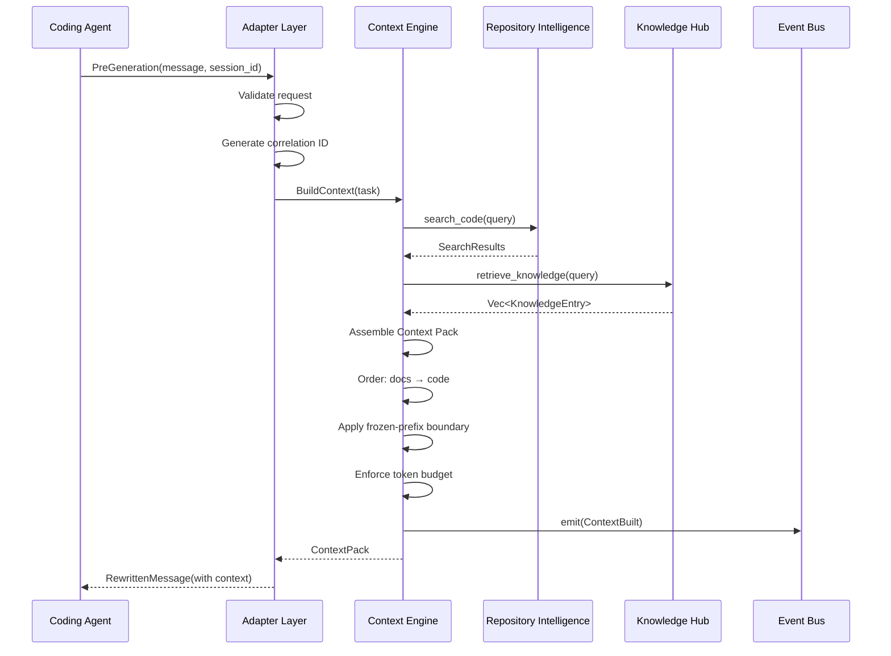

# Runtime

> **V1 framing:** see [V1_RUNTIME_SPEC.md](V1_RUNTIME_SPEC.md) — product definition,
> ownership boundaries, and the out-of-scope list. Removed capabilities (Model Router /
> LiteLLM, v0.8.6; workflow and the Skill Engine — see `REMOVED_TOOLS.md`) are
> deleted from this file. Where this file conflicts with the V1 spec or the code,
> the V1 spec / code win.

## Purpose

Define how the AI Runtime operates as a local daemon application. This document specifies the process lifecycle, configuration loading, repository initialization, IPC protocol, request handling, shutdown, persistence, logging, error handling, and fail-open behavior.

## Process Model

### Single Daemon Process

The runtime runs as a single Rust daemon process. The daemon hosts a Unix domain socket server that accepts connections from coding agents. All module logic executes within this process using async tasks on the tokio runtime.

### Process Lifecycle

```
Start (knocode serve)
  │
  ├── Load configuration
  ├── Initialize logging + metrics
  ├── Open/create SQLite database (metadata only — see REMOVED_TOOLS.md)
  ├── Open/create Tantivy index (sole retrieval; no MkDocs ingestion)
  ├── Build ContextEngine (single index path: reindex_repository)
  │
  ├── Readiness = "indexing" (reported by /health + /metrics)
  ├── Bind HTTP health/metrics listener FIRST — reachable during indexing;
  │     POST /hook returns 503 (reason: "daemon_indexing") until ready
  ├── Run initial repository index to completion (readiness gate)
  │     — on failure/panic: log loudly, still flip to ready (degraded: ripgrep fallback)
  ├── Readiness = "ready"
  ├── Start auto-reindex watcher (commit | filesystem)
  │     — each watcher reindex flips readiness: ready → indexing → ready
  ├── Bind UDS/MessagePack adapter (primary transport — only after the index)
  │
  │   ┌─── Running ───────────────────────────────────────┐
  │   │                                                    │
  │   │   Accept agent connections (UDS)                   │
  │   │   UDS Probe payload → state / index_files / version│
  │   │   Handle pre-generation hooks (BuildContext)       │
  │   │   Emit observability events                        │
  │   │   Background: incremental indexing on git change   │
  │   │                                                    │
  │   └────────────────────────────────────────────────────┘
  │
  │   Signal: SIGINT / SIGTERM / Ctrl+C
  │
  ├── Stop accepting new connections
  ├── Drain in-flight requests (max 30s)
  ├── Stop auto-reindex watcher (poll loops exit within one interval)
  ├── Flush Tantivy index
  ├── Close SQLite connection
  ├── Flush logs
  └── Exit
```

### Signal Handling

| Signal | Behavior |
|--------|----------|
| SIGINT | Graceful shutdown: stop accepting, drain in-flight, exit |
| SIGTERM | Graceful shutdown: stop accepting, drain in-flight, exit |
| SIGHUP | Reload configuration from disk |
| SIGUSR1 | Force re-index repository |

## Startup Sequence

### Step 1: Configuration Loading

```
1. Check for project-local config: .knocode/config.toml
2. Check for user config: ~/.config/knocode/config.toml
3. Check for environment variables: KNOCODE_*
4. Merge in order: user < project < environment
5. Validate all required fields are present
6. Fail with clear error message if required fields are missing
```

### Step 2: Logging Initialization

```
1. Read log level from configuration (default: INFO)
2. Initialize tracing subscriber with:
   - stdout layer (structured JSON)
   - optional file layer (if log_path configured)
   - optional stderr layer (for ERROR level)
3. Set global default for correlation ID propagation
```

### Step 3: Database Initialization

```
1. Open SQLite at configured path (default: ~/.knocode/data.db)
2. Create tables if they do not exist (migration 001)
3. Set WAL mode for concurrent reads
4. Initialize connection pool (max 5 connections)
5. Verify database is readable and writable
```

### Step 4: Index Initialization

```
1. Check if Tantivy index exists at configured path
2. If exists: open index
3. If not exists: create index with defined schema
4. Verify index is readable
```

### Step 5: Initial Repository Indexing (readiness-gated)

> Runs to completion (success or failure) BEFORE the UDS/MessagePack adapter binds,
> so no request on the primary transport can wait on the engine lock mid-index or
> race a half-built index. During this phase the HTTP health/metrics listener is
> already up and reports `state: "indexing"`.

```
1. Check if repository is already indexed (SQLite metadata)
2. If indexed: compare file hashes, identify changes
3. If not indexed: schedule full index
4. Index runs on tokio's blocking pool via the ContextEngine (single index path):
   a. Walk repository directory tree
   b. Skip .git, node_modules, target, __pycache__, .venv
   c. Parse each source file with tree-sitter (incremental)
   d. Extract symbols, imports, structure
   e. Add to BM25/tantivy index
   f. Store metadata in SQLite
   g. Detect project type and conventions
5. On completion (success or failure) flip readiness to "ready"
6. Log indexing statistics
```

### Step 6: Auto-Reindex Watcher

> Starts after the initial index. Mode from `[index].watch_mode`: `commit` (default,
> polls the resolved git HEAD) or `filesystem` (real-time via notify). Each reindex
> flips readiness to `"indexing"` for its duration so clients back off instead of
> queueing on the engine lock.

### Step 7: UDS/MessagePack Adapter Bind

```
1. Create Unix socket at configured path (default: /tmp/knocode.sock)
2. Set socket permissions (owner read/write only)
3. Bind — only after the initial index completed (readiness gate)
4. Log server startup with socket path
5. Ready to serve requests
```

## Configuration

### Configuration File Locations

| Priority | Path | Purpose |
|----------|------|---------|
| 1 (lowest) | `~/.config/knocode/config.toml` | User-wide defaults |
| 2 | `.knocode/config.toml` | Project-specific overrides |
| 3 (highest) | Environment variables `KNOCODE_*` | Runtime overrides |

### Configuration Schema

```toml
# ~/.config/knocode/config.toml

[daemon]
socket_path = "/tmp/knocode.sock"    # Unix socket path
max_concurrent = 10                   # Max concurrent requests
request_timeout_ms = 30000            # Max time for BuildContext (fail-open)

[database]
path = "~/.knocode/data.db"          # SQLite database path
max_connections = 5                   # Connection pool size

[index]
path = "~/.knocode/index/"           # Tantivy index directory
languages = ["rust", "typescript", "javascript", "python"]  # 111 languages supported via arborium; add any from arborium's language list

[knowledge]
max_knowledge_entries = 10000         # Max knowledge entries (engram removed — see REMOVED_TOOLS.md)         # Max knowledge entries

[context]
max_tokens = 12000                    # Max tokens per Context Pack
max_files = 20                        # Max files in Context Pack
max_lines_per_file = 500             # Max lines per file in Context Pack
cache_order = ["docs_context", "code_context"]  # Fixed order

# [model] / [routing] / [litellm] removed in v0.8.6 — the runtime is
# model-agnostic; the agent/provider/user selects the model (V1_RUNTIME_SPEC.md §2.3)
# [skills] removed — the runtime no longer loads or matches skills (REMOVED_TOOLS.md)

# [rtk] removed — tool-output compression lives in RTK (external binary),
# not in the daemon (REMOVED_TOOLS.md)

# [workflow] — v1 REMOVED (future/workflow only, opt-in --features workflow)
# See future/workflow/README.md — not part of v1 runtime (TASK-001)
# enabled = false
# engine = "noop"
# dbos_endpoint = "http://localhost:3001"

[logging]
level = "info"                        # Log level: error, warn, info, debug, trace
file_path = "~/.knocode/logs/knocode.log"  # Log file path
max_size_mb = 100                     # Max log file size
retention_days = 7                    # Log retention
```

### Environment Variables

| Variable | Overrides | Default |
|----------|-----------|---------|
| `KNOCODE_DAEMON_SOCKET` | daemon.socket_path | /tmp/knocode.sock |
| `KNOCODE_DATABASE_PATH` | database.path | ~/.knocode/data.db |
| `KNOCODE_LOG_LEVEL` | logging.level | info |
| `KNOCODE_CONTEXT_MAX_TOKENS` | context.max_tokens | 12000 |
| `KNOCODE_ENGRAM_ENDPOINT` | *removed* — engram retired (see REMOVED_TOOLS.md) | — |
| `KNOCODE_MODEL_DEFAULT` | *removed v0.8.6* — model router deleted | — |
| `KNOCODE_LITELLM_URL` | *removed v0.8.6* — LiteLLM deleted | — |

## IPC Protocol

### Unix Domain Socket

The daemon communicates with coding agents over a Unix domain socket using MessagePack encoding.

### Message Format

```rust
// Request from agent to daemon
struct AgentRequest {
    correlation_id: String,           // req_{uuid}
    hook_type: HookType,              // PreGeneration | Probe
    payload: RequestPayload,          // MessageRewrite | Probe
    repository_id: String,            // TASK-021: hash of repo path
    timestamp: String,                // ISO8601 request creation time
}

// Response from daemon to agent
struct AgentResponse {
    correlation_id: String,
    hook_type: HookType,
    payload: ResponsePayload,         // RewrittenMessage | OriginalPassthrough | Probe
    latency_ms: u64,
    error: Option<String>,            // Non-fatal error message
}

enum HookType {
    PreGeneration,
    Probe,                            // readiness probe (V1_RUNTIME_SPEC.md §5)
}

enum RequestPayload {
    MessageRewrite {
        session_id: String,
        message: String,
        context_hints: Option<ContextHints>,
        repository_path: Option<String>, // agent workspace root (TASK-036)
    },
    Probe,                            // readiness probe
}

enum ResponsePayload {
    RewrittenMessage {
        original: String,
        rewritten: String,
        context_pack: Option<ContextPack>,
    },
    OriginalPassthrough {
        original: String,
        reason: String,               // "timeout" | "error" | "fail-open"
    },
    Probe {
        state: String,                // "indexing" | "ready"
        index_files: usize,
        version: String,
    },
}
```

### Readiness & Probe

The daemon exposes a readiness state so clients can wait before sending requests
instead of queueing on the engine lock mid-index. State machine:

```
indexing ──(initial index completes)──► ready ──(auto-reindex starts)──► indexing ──► ready
```

| Surface | When not ready | When ready |
|---------|----------------|------------|
| HTTP `GET /health` | `{"state": "indexing", "index_files": N}` | `{"status": "ok", "state": "ready", ...}` |
| HTTP `GET /metrics` | `knocode_daemon_ready 0` | `knocode_daemon_ready 1` |
| HTTP `POST /hook` | HTTP `503` `reason: "daemon_indexing"` | processes the request |
| Daemon MCP `POST /mcp` | `tools/call` -> JSON-RPC error `-32001 daemon_indexing` (HTTP `200`) | `tools/call` processes `knocode_context` (compression = RTK, external) |
| UDS `Probe` payload | `Probe { state: "indexing", ... }` | `Probe { state: "ready", ... }` |

Wire example (UDS/MessagePack primary):

```json
// Request
{ "correlation_id": "req_abc", "hook_type": "Probe", "payload": { "type": "Probe" } }

// Response
{ "correlation_id": "req_abc", "hook_type": "Probe", "payload": {
    "type": "Probe", "state": "ready", "index_files": 142, "version": "0.9.0" },
  "latency_ms": 0, "error": null }
```

Client guidance:

1. **Cold start:** the UDS socket is NOT bound until the initial index completes
   (readiness gate), so poll HTTP `GET /health` until `state == "ready"`.
2. **Post-startup:** the UDS `Probe` payload answers on the primary transport —
   never rate-limited, never gated, no engine lock. It reports `indexing` during
   auto-reindexes; retry with backoff instead of sending real requests.
3. HTTP `POST /hook` during indexing returns `503 daemon_indexing` — a retry
   signal, **not** a fail-open passthrough (fail-open still guarantees the agent
   always gets a `RewrittenMessage` once ready).

4. **MCP clients** (`POST /mcp`) get the same signal as JSON-RPC: `initialize`/`ping`/`tools/list` answer while indexing, but `tools/call` returns error `-32001 daemon_indexing` (HTTP stays `200`) - a retry signal, never a transport failure.

### Fail-Open Behavior

On any error or timeout, the daemon returns `OriginalPassthrough` with the original message unchanged. The agent always gets a response.

| Condition | Response | Reason |
|-----------|----------|--------|
| BuildContext timeout (> 30s) | OriginalPassthrough | "timeout" |
| BuildContext error | OriginalPassthrough | "error" |
| Context Engine failure | OriginalPassthrough | "fail-open" |
| Repository not indexed | OriginalPassthrough | "fail-open" |
| Any internal error | OriginalPassthrough | "fail-open" |

## Request Handling

### Pre-Generation Request Flow



### Pre-Tool Request Flow

Tool outputs are **not** compressed by the daemon. Tool-output compression lives
entirely in RTK (external binary, wired by the installers via `rtk init`). The
`PreToolCall`/`ToolOutput`/`CompressedOutput` IPC variants were removed —
see `REMOVED_TOOLS.md`.

## Shutdown

### Graceful Shutdown Sequence

```
1. Receive SIGINT/SIGTERM
2. Set shutdown flag (atomic bool)
3. Stop accepting new UDS connections
4. Wait for in-flight requests to complete (max 30 seconds)
5. If requests still in-flight after 30s:
   a. Log warning for each in-flight request
   b. Force completion
6. Flush Tantivy index (merge pending segments)
7. Close SQLite connection pool
8. Close knowledge store
9. Flush log buffers
10. Remove Unix socket file
11. Log shutdown complete
12. Exit with code 0
```

### Force Shutdown

If the process receives a second signal during graceful shutdown:
1. Log immediate shutdown
2. Exit with code 1

## Persistence

### SQLite Schema (Migration 001)

```sql
-- Files tracked in the repository
CREATE TABLE files (
    id INTEGER PRIMARY KEY AUTOINCREMENT,
    path TEXT NOT NULL UNIQUE,
    hash TEXT NOT NULL,
    size INTEGER NOT NULL,
    language TEXT,
    last_indexed_at TEXT NOT NULL,
    created_at TEXT NOT NULL DEFAULT CURRENT_TIMESTAMP
);

-- Symbols (functions, classes, structs, etc.)
CREATE TABLE symbols (
    id INTEGER PRIMARY KEY AUTOINCREMENT,
    file_id INTEGER NOT NULL REFERENCES files(id),
    name TEXT NOT NULL,
    kind TEXT NOT NULL,
    line_start INTEGER NOT NULL,
    line_end INTEGER NOT NULL,
    parent_id INTEGER REFERENCES symbols(id),
    created_at TEXT NOT NULL DEFAULT CURRENT_TIMESTAMP
);

-- Token usage tracking
CREATE TABLE token_usage (
    id INTEGER PRIMARY KEY AUTOINCREMENT,
    correlation_id TEXT NOT NULL,
    request_type TEXT NOT NULL,
    input_tokens INTEGER NOT NULL,
    output_tokens INTEGER NOT NULL,
    model TEXT NOT NULL,
    tier TEXT NOT NULL,
    created_at TEXT NOT NULL DEFAULT CURRENT_TIMESTAMP
);

-- Indexes
CREATE INDEX idx_files_path ON files(path);
CREATE INDEX idx_files_hash ON files(hash);
CREATE INDEX idx_symbols_file_id ON symbols(file_id);
CREATE INDEX idx_symbols_name ON symbols(name);
CREATE INDEX idx_token_usage_correlation ON token_usage(correlation_id);
```

### Memory Schema (SQLite+tantivy local — engram removed, see REMOVED_TOOLS.md)

SQLite manages memory. The runtime stores:

| Namespace | Content |
|-----------|---------|
| `conventions` | Coding conventions detected from repository |
| `patterns` | Architectural patterns detected from repository |
| `domain_terms` | Domain-specific terminology definitions |
| `decisions` | Architectural decisions and their rationale |

### Tantivy Index Schema

```rust
Schema::builder()
    .add_text_field("content", TEXT | STORED)      // Full file content
    .add_text_field("path", TEXT | STORED)          // File path
    .add_text_field("language", TEXT | STORED)      // Programming language
    .add_text_field("symbols", TEXT)                // Symbol names
    .add_i64_field("size", STORED)                 // File size
    .add_date_field("indexed_at", STORED)           // When indexed
    .build()
```

## Logging

### Log Format

Structured JSON format:

```json
{
  "timestamp": "2025-01-15T10:30:00Z",
  "level": "info",
  "correlation_id": "req_abc123",
  "module": "context_engine",
  "message": "Context Pack built",
  "details": {
    "files_included": 5,
    "knowledge_entries": 3,
    "total_tokens": 8500,
    "latency_ms": 12
  }
}
```

### Log Levels

| Level | When to Use |
|-------|-------------|
| ERROR | Component failure, request failure, database corruption |
| WARN | Recoverable issue, degraded performance, retry needed |
| INFO | Request lifecycle, indexing progress |
| DEBUG | Module decisions, search results, retrieval scores |
| TRACE | Full data flow, token counting, context assembly details |

## Error Handling

### Error Categories

| Category | Behavior | Example |
|----------|----------|---------|
| **Timeout** | Return OriginalPassthrough (fail-open) | BuildContext exceeds 30s |
| **Request Error** | Return OriginalPassthrough (fail-open) | Invalid request body |
| **Degraded** | Continue with reduced functionality, return partial context | Knowledge retrieval failed |
| **Transient** | Retry once, then fail-open | Provider timeout (agent-side) |
| **Fatal** | Process exits with code 1 | SQLite corrupted, configuration invalid |

### Error Response Format

```json
{
  "correlation_id": "req_abc123",
  "payload": {
    "OriginalPassthrough": {
      "original": "original message",
      "reason": "fail-open: context engine timeout"
    }
  },
  "latency_ms": 30001,
  "error": "Context engine exceeded 30s timeout, passing through original message"
}
```

### Error Codes

| Code | Category | Description |
|------|----------|-------------|
| HOOK_TIMEOUT | Timeout | Pre-generation hook exceeded 30s |
| INVALID_REQUEST | Request Error | Request body validation failed |
| INDEX_NOT_READY | Degraded | Repository not yet indexed |
| CONTEXT_BUILD_FAILED | Degraded | Context assembly partial failure |
| KNOWLEDGE_RETRIEVAL_FAILED | Degraded | Knowledge search failed, continue without knowledge |
| DATABASE_ERROR | Fatal | SQLite operations failed |
| INDEX_ERROR | Fatal | Tantivy operations failed |
| MEMORY_UNAVAILABLE | Degraded | Memory store unreachable, continue without memory |
| CONFIGURATION_ERROR | Fatal | Invalid or missing configuration |
